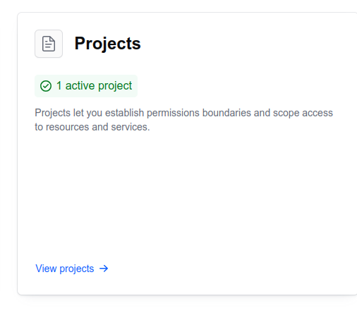
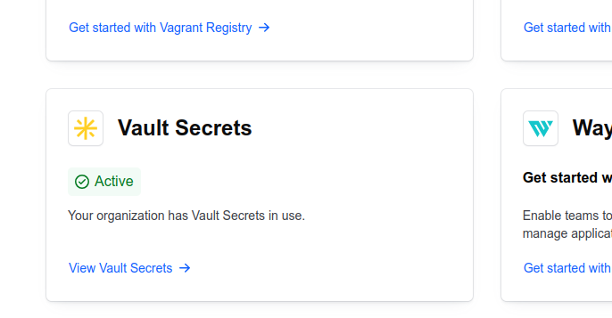
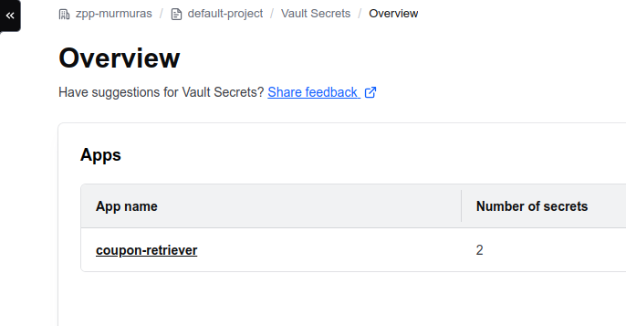

# Way of work
1. Every task will be assigned and tracked by github issues.
2. Issues that require updates of the codebase will be resolved by PRs.
3. Name of each PR should be the same as the issue it tries to resolve (if there is no issue, name should be descriptive).
4. PRs require at least one approval, and all conversations resolved.
5. We have weekly meeting on Thursdays, 10:30 am with Murmuras team.
6. We name our files and folders using snake_case.
7. Datasets given to us by Murmuras should not be pushed to repo. There is separate tool for downloading them described below.
## Credentials
We use HashiCorp vault for storing credentials and API keys. You can access credentials from it both by the web browser and the CLI tool.
### Getting access to vault
For if you do not have access please contact SzymonKozl
### Access via browser
Go to our organization page on [portal.cloud.hashicorp.com]. Select the projects' subpage:

And choose `default-project` project.</br>
Now, scroll down to the "Vault Secrets" widget:

Finally, select our application:

Now you can browse our credentials and their values.
### Access via CLI:
HashiCorp provides nice CLI tool for accessing credentials. This can be used for automating secrets downloading.</br>
#### Additional usage examples:
* [retrieving a secret](https://developer.hashicorp.com/hcp/tutorials/get-started-hcp-vault-secrets/hcp-vault-secrets-retrieve-secret)
## Datasets
### Getting credentials
Datasets are stored on Google Drive with limited access. To download them ask SzymonKozl for credentials and put them inside `tools/gdrive_credentials.json` file.
### Dependencies install
Script requires dependencies from `tools/requirements.txt`. Install them.
### Using script
For downloading dataset into `datasets/<ds_name>` directory run command
```bash
python tools/data_load.py <ds_name>
```
inside root dir. </br>
Currently available datasets:
* `ads_1`: views from youtube, tiktok and instagram provided as sample of data with adverts
* `coupons_0`: example coupon data, copied from coupon_extraction_demo
* `coupons_1`: new dataset on coupons, mostly video, various apps

# More to come