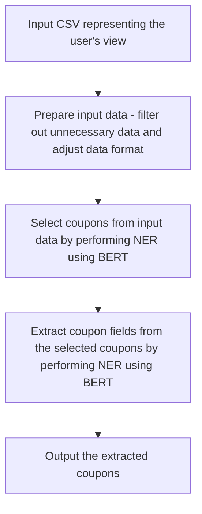

# Terminology used in our project
This document provides a list of terms used in our project and their definitions. 

## Model naming conventions
Our project uses a specific naming convention for models. The naming convention is as follows:

    bert-{selection / extraction}-{dataset: json / pl}-{fine tune type}

    llama-{fine tune type}

Fine tune types refer to the format of the saved model such as `gguf`, `unsloth`, etc.

Selection refers to coupon selection, ie. identifying and selecting the coupons from the text. Extraction refers to field extraction, ie. extracting the fields from the coupons such as product name, discount, etc.

## Dataset naming conventions
#### Llama datasets

We have four types of datasets for llama models:

    1. one_input_one_output_wrequest
    2. one_input_one_output_wthrequest
    3. one_input_multiple_outputs_wrequest
    4. one_input_multiple_outputs_wthrequest

We are using the last two dataset types in our project.
llama-ds-w - dataset with one_input_multiple_outputs_wrequest
llama-ds-wth - dataset with one_input_multiple_outputs_wthrequest

    w - meaning with requests to llama
    wth - meaning without requests to llama

Henceforth, **llama-ds-w** refers solely to one_input_multiple_outputs_wrequest, while **llama-ds-wth** refers solely to one_input_multiple_outputs_wthrequest. The difference between these two is described below in the section on BERT.

#### BERT datasets
We are using two types of datasets for bert models:

    1. json 
    2. plain text 

BERT datasets are named as follows:

    **bert-{selection / extraction}-ds.{json / pl}**

## CSV file formats
We have two types of CSV file formats:

    format=1: values in "content_full" column are in the form of a list of strings without quotation marks separated by ", " (commas followed by a space)

    format=2: values in "content_full" column are in the form of a list of strings surrounded by single quotation marks and separated by "," (commas without spaces after them)

## Formats
### Coupon formats
This is the coupon format that we are using:

```python
@dataclass()
class CouponSimple:
    """
    Class representing a simple coupon.
    """
    product_name: str
    discount_text: str
    validity_text: str
    activation_text: str
``` 

## Benchmark Formats

The input data is found in the `*_content_generic_*` files, while the ground truth is found in the `*_coupons_*` files. Both are in the .csv format.

The benchmark evaluates the accuracy of the pipeline by running the pipeline on numerous .csv files contained in the input folder, and comparing the output to the ground truth. Each .csv file must include the following required headers: "view_depth", "text", "description", "seen_timestamp", and "is_visible". Other headers may be present in the .csv file. 

The benchmark receives a .csv file containing the ground truth, ie. the coupons extracted from the input data. This file must contain the following headers if it will process simple coupons
```txt
'product_name', 'discount_text', 'valid_until', 'activation_text'

```
or the following headers if it will process extended coupons
```txt
'product_name', 'new_price', 'old_price', 'percents', 'other_discounts', 'dates'
```

The benchmark outputs both the similarity scores and identifies any isolated/"lonely" coupons, coupons that are not associated with any other coupons in the dataset.

## Pipeline input and output formats
Each pipeline receives as input a .csv file containing the following headers: "view_depth", "text", "description", "seen_timestamp", and "is_visible". 

It will output the identified coupons in a .csv file that is of the same format as the ground truth file described above.

## BERT models
Currently the BERT model accepts two formats:
1. Raw, concatenated texts from the `test` field in the .csv content_generic file.
2. An XML tree taken from the content_generic .csv file, encoded in a JSON as shown below:

```json
{
    "text": "text field content",
    "children": {
        "child1_view_id": ...,
        "child2_view_id": ...
        ...
    }
}
```

The output of the model is a list of labels that say whether or not a given part of the text is part of a coupon or not. The labels are as follows:
```txt
UNK: not a coupon
B-COUPON: beginning of a coupon
I-COUPON: the rest of the coupon
```

### BERT pipeline

___
## Llama models
The input for the Llama models has the following format:
```python
{
    "text": "{prompt for the llama model}
            ### Input: 
            {input strings}
            ### Output:
            {corresponding output strings}" 
}
```

The output of the Llama models is:
```json
[
  {
    "activation_text": "...",
    "product_name": "...",
    "discount_text": "...",
    "valid_until": "..."
  },
  ...
]
```
