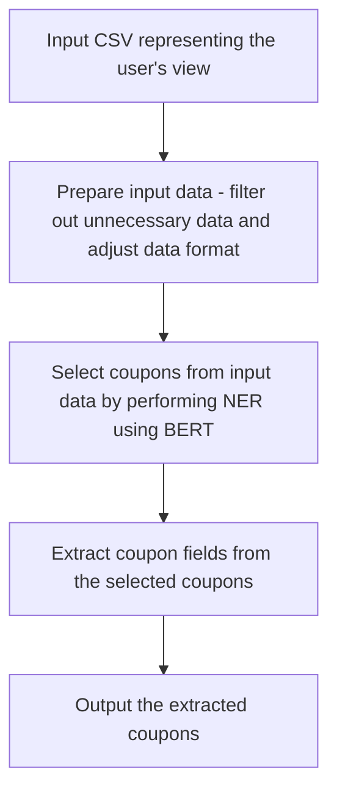

# Terminology used in our project
This document provides a list of terms used in our project and their definitions. 

___ 
## Model naming conventions
Our project uses a specific naming convention for models. The naming convention is as follows:

    bert-{selection / extraction}-{data set: json / plain}-{fine tune type}

    llama-{fine tune type}

Selection refers to coupon selection, ie. identifying and selecting the coupons from the text. Extraction refers to field extraction, ie. extracting the fields from the coupons such as product name, discount, etc.

## Data set naming conventions
#### Llama data sets

We have four types of data sets for llama models:

    1. one_input_one_output_wrequest
    2. one_input_one_output_wthrequest
    3. one_input_multiple_outputs_wrequest
    4. one_input_multiple_outputs_wthrequest

We are using the last two dataset types in our project.
In the naming convention, the following abbreviations are used:

    w - meaning with requests to llama
    wth - meaning without requests to llama

Henceforth, **llama-ds-w** refers solely to one_input_multiple_outputs_wrequest, while **llama-ds-wth** refers solely to one_input_multiple_outputs_wthrequest.

#### BERT data sets
We are using two types of data sets for bert models:

    1. json (.json)
    2. plain text (.pl)

BERT data sets are named as follows:

    **bert-{selection / extraction}-ds.{json / pl}**

___
## CSV file formats
We have two types of CSV file formats:

    format=1: values in "content_full" column are in the form of a list of strings without quotation marks separated by ", " (commas followed by a space)

    format=2: values in "content_full" column are in the form of a list of strings surrounded by single quotation marks and separated by "," (commas without spaces after them)

___
## Formats
### Coupon formats
We have two coupon formats representing the data associated with a signle coupon. We have two levels of complexity for coupons: simple and normal/extended.

```python
@dataclass()
class Coupon:
    """
    Class representing data associated with a single coupon.
    """
    product_name: str
    new_price: Optional[str] = None
    old_price: Optional[str] = None
    percents: List[str] = field(default_factory=list)
    other_discounts: List[str] = field(default_factory=list)
    dates: Optional[str] = None


@dataclass()
class CouponSimple:
    """
    Class representing a simple coupon.
    """
    product_name: str
    discount_text: str
    validity_text: str
    activation_text: str
``` 
___
### Input and output formats

#### Benchmark

The input data is found in the `*_content_generic_*` files, while the ground truth is found in the `*_coupons_*` files. Both are in the .csv format.

The benchmark evaluates the accuracy of the pipeline by running the pipeline on numerous .csv files contained in the input folder, and comparing the output to the ground truth. Each .csv file must include the following required headers: "view_depth", "text", "description", "seen_timestamp", and "is_visible". Other headers may be present in the .csv file. 

The benchmark receives a .csv file containing the ground truth, ie. the coupons extracted from the input data. This file must contain the following headers if it will process simple coupons
```txt
'product_name', 'discount_text', 'valid_until', 'activation_text'

```
or the following headers if it will process extended coupons
```txt
'product_name', 'new_price', 'old_price', 'percents', 'other_discounts', 'dates'
```

The benchmark outputs both the similarity scores and identifies any isolated/"lonely" coupons, coupons that are not associated with any other coupons in the dataset.

#### Pipelines

Each pipeline receives as input a .csv file containing the following headers: "view_depth", "text", "description", "seen_timestamp", and "is_visible". 

It will output the identified coupons in a .csv file that is of the same format as the ground truth file described above.

#### BERT models
Currently the BERT model accepts two formats:
1. Raw, concatenated texts from the `test` field in the .csv content_generic file.
2. An XML tree taken from the content_generic .csv file, encoded in a JSON as shown below:

```json
{
    "text": "text field content",
    "children": {
        "child1_view_id": ...,
        "child2_view_id": ...
        ...
    }
}
```

The output of the model is a list of labels that say whether or not a given part of the text is part of a coupon or not. The labels are as follows:
```txt
UNK: not a coupon
B-COUPON: beginning of a coupon
I-COUPON: the rest of the coupon
```

#### Llama models
The input for the Llama models has the following format:
```python
{
    "text": "{prompt for the llama model}
            ### Input: 
            {input strings separated by newlines}
            ### Output:
            {corresponding output strings separated by newlines}" 
}
```

The output of the Llama models is:
```json
[
  {
    "activation_text": "...",
    "product_name": "...",
    "discount_text": "...",
    "valid_until": "..."
  },
  ...
]
```

___
## Architecture overview

### BERT pipeline



### BERT Model Architecture

```mermaid
graph TD
    A[Input Text: "The cat sits on the mat."] --> B[Tokenization]
    B --> C{Tokens}
    C --> C1[[ [CLS] ]]
    C --> C2[[ the ]]
    C --> C3[[ cat ]]
    C --> C4[[ sits ]]
    C --> C5[[ on ]]
    C --> C6[[ the ]]
    C --> C7[[ mat ]]
    C --> C8[[ [SEP] ]]

    C --> D[Embedding Layer]
    D --> E1[Token Embedding]
    D --> E2[Segment Embedding]
    D --> E3[Position Embedding]

    D --> F[Transformer Encoder]
    F --> G1[Self-Attention Mechanism]
    F --> G2[Feed-Forward Network]

    F --> H[Output Layer]
    H --> I1[[ [CLS] Output for Classification ]]
    H --> I2[[ Token Outputs for Token-Level Tasks ]]
``` 
