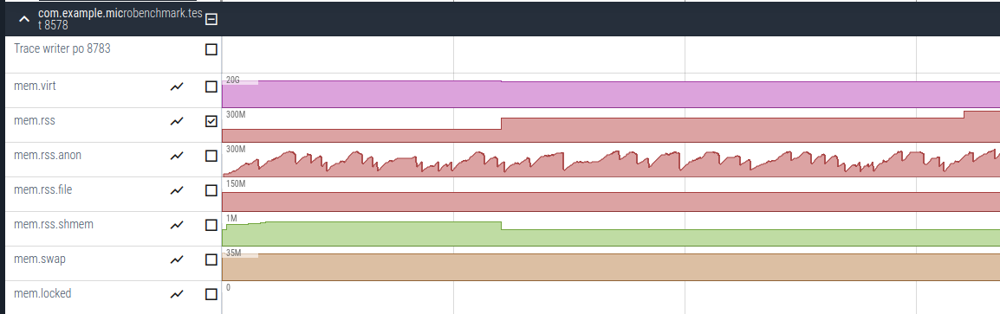
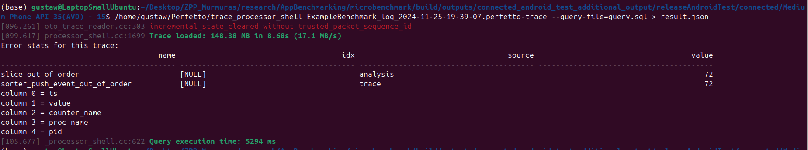

# Benchmarking android apps
This folder contains a very simple app utilizing Android benchmarking library, called Jetpack.

IMPORTANT: There are issues with the benchmarking library on XIAOMI devices. \
Because of that I was only able to test the app on the emulator (which is not advised).
According to Kamil, this works on Samsung Galaxy A25.

## Project structure:
As you can see, the project is split into three modules:
1. app: this module contains the main code of the app
2. benchmarkable: this module contains code that is supposed to be benchmarked
3. microbenchmark: this module contains benchmarking tests

This separation comes from the fact that I use a "Microbenchmark". This is a type of benchmarking test that \
lets us test the performance of a single method. So, if we want to see how much memory our model took to run,
we should wrap it in a method and test it in a benchmarking test. There is also a "Macrobenchmark" that do the same thing but for the whole app, but I don't think it will be useful to us. \
Anyway, this separation mainly comes from the fact that benchmarks should be run in a release version of the app to get the most accurate results. \
Not separating this code from the rest of the app could prevent us from running tests in a debug version of the app.

## Output of the benchmarking tests:
Outputs can be found under something like this:
```
build/outputs/connected_android_test_additional_output/debugAndroidTest/connected/
```
E.g, for me it was:
```
/build/outputs/connected_android_test_additional_output/releaseAndroidTest/connected/Medium_Phone_API_35(AVD) - 15
```
where build is a subdir of the project root.
You can find there a .json file containing some basic info, but the most important file is the .perfetto-trace file. \
This file basically contains the dump of the whole system while the benchmarking tests were running. \
As its extention suggests, it is a Perfetto trace file, and you can open it with the Perfetto viewer, 
which can be found [here](https://ui.perfetto.dev/). \
There you can load the file from your PC and browse its contents (example json and trace can be found in data_dump.zip).

## Perfetto environment:
At first, the number of things that Perfetto can show you can be overwhelming. It basically shows you the whole system, \
but with the search option you can find a specific app. For example, below you can see memory usage of the benchmarking app:



On the left there is a menu with different options (e.g. convertion to different formats or Metrics). In metrics we can examine different data
in a specific format (e.g. json).

## Get json from Perfetto:
To get a json that we can later process with e.g. python, and that contains only the data we are interested in, \
I suggest we use a cmd tool from Perfetto.

In order to install it, visit https://github.com/google/perfetto/releases, and then download an appropriate .zip. \
Next, extract it, and possibly add it to the PATH. Also, remember to 
```bash
chmod +x
```
every script in the extracted folder.

Now, enter the directory with your .perfetto-trace file, and then create a .sql file that
will contain the following:
```SQL
SELECT 
    c.ts, 
    c.value, 
    t.name AS counter_name, 
    p.name AS proc_name, 
    p.pid
FROM 
    counter AS c
LEFT JOIN 
    process_counter_track AS t ON c.track_id = t.id
LEFT JOIN 
    process AS p USING (upid)
WHERE 
    t.name LIKE 'mem.%'
    AND p.pid = 8578;
```
NOTE: this will fetch data that you can see on the picture above, for my trace. For your custom trace and test, \
you have to find the pid of the app you are testing (as you can see above, it's under the name of the app). \

Then, you should run something like this:
```
# Load results of the sql query into a file:
trace_processor_shell my_trace_file.pftrace --query-file=query.sql > results.json
```

I didn't add the script to the PATH, so for me it was:
```
# Load results of the sql query into a file:
/home/gustaw/Perfetto/trace_processor_shell ExampleBenchmark_log_2024-11-25-19-39-07.perfetto-trace --query-file=query.sql > results.json
```

Command-line view:


Example json file can be also found in the data_dump.zip.

Now we have data that we can e.g. load with python, and plot it to compare apps with different models/approaches.

## Helpful links:
1. [Jetpack benchmarking](https://developer.android.com/topic/performance/benchmarking/benchmarking-overview)
2. [Perfetto viewer](https://ui.perfetto.dev/)
3. [Perfetto releases](https://github.com/google/perfetto/releases)
4. [Perfetto sql query](https://perfetto.dev/docs/data-sources/memory-counters)

## Possible further steps:
I saw that LiteRT (former TensorFlow) has its dedicated tool for benchmarking, but it's a command line app, \
and its commands were looking similar to the ones for Android Studio. Still, if we end up using LiteRT, \
we may consider using the dedicated tool for benchmarking (current approach is more robust).

