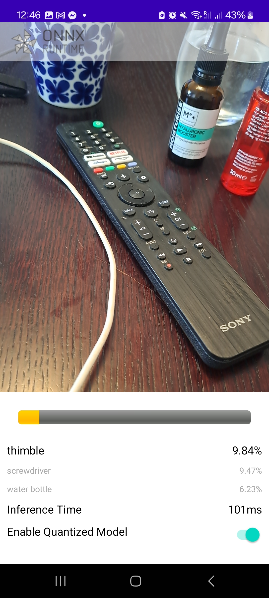
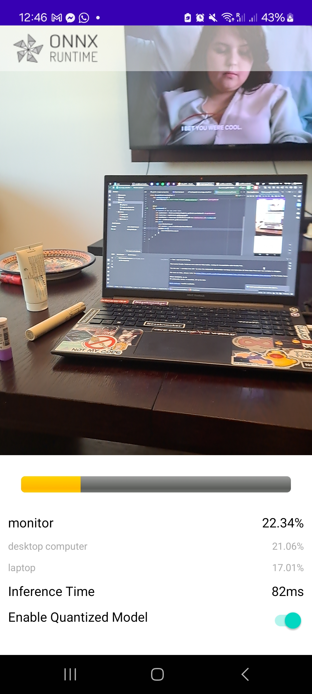
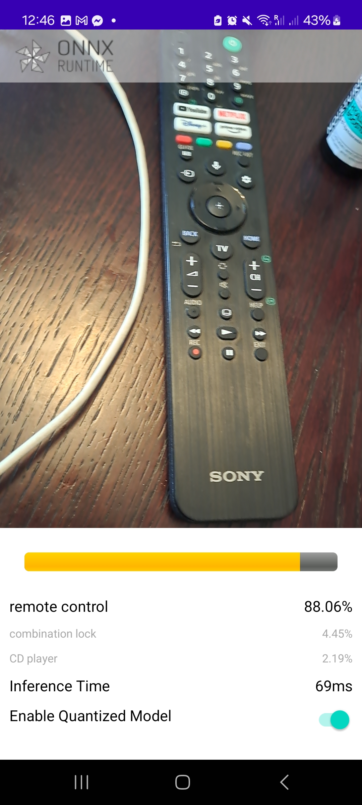
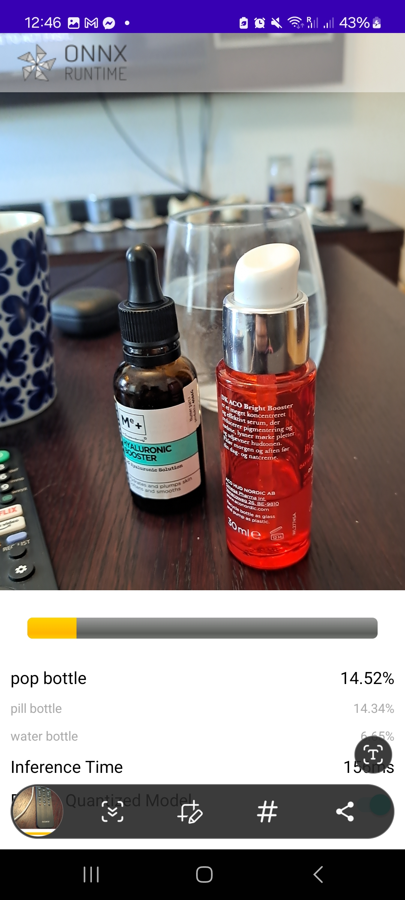
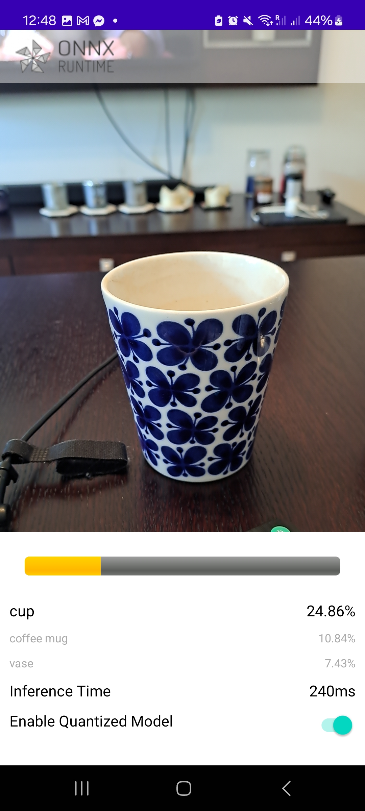
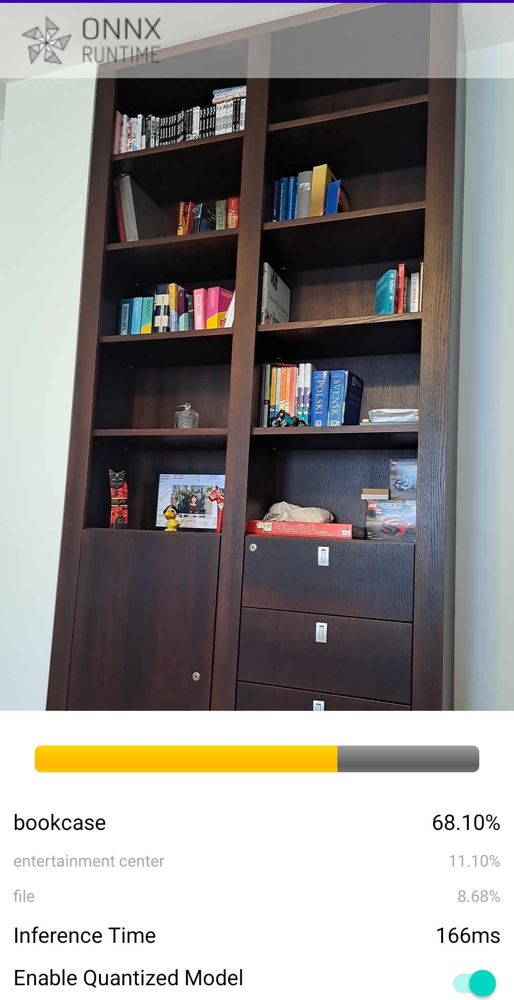

# ONNX Tutorial App: Mobile Deployment Success

I successfully launched the ONNX Runtime tutorial application on my mobile device and deployed a model using the Android platform. This milestone demonstrates the capability of ONNX Runtime to facilitate efficient AI model inference on mobile platforms. It is not perfect as seen on this  but sometimes it does work quite well. It was able to give an answer in real time to visual input from my camera, however it often did not correctly identify the object. I have not tested it on a custom model so perhaps it will work better if the model receives text data and has time to process it. 

## Project Overview

This project followed the [ONNX Runtime Mobile Deployment tutorial](https://onnxruntime.ai/docs/tutorials/mobile/deploy-android.html) to:

1. **Set Up the ONNX Tutorial App**: The application was installed and configured on an Android device.
2. **Deploy a Pre-trained Model**: A compatible ONNX model was successfully deployed and tested on the mobile device.
3. **Run AI Inference Locally**: Inference was executed directly on the mobile device, showcasing the app's real-time processing capabilities.

## Screenshots

Below are screenshots of the app in action (located in the `screenshots/` folder):

  

## References

- [ONNX Runtime Mobile Deployment Tutorial](https://onnxruntime.ai/docs/tutorials/mobile/deploy-android.html)

